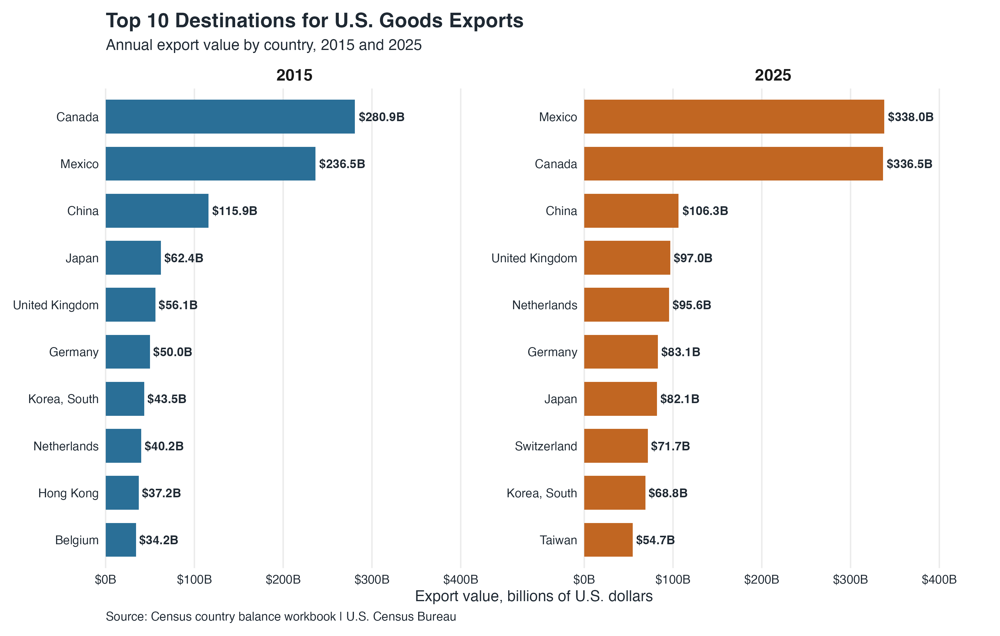

# lab_FDI_trade
Lab code for Global Macro Data Analysis for Public Policy, Spring 2026

## Last lab assignment: U.S. export destinations

For the final lab assignment, I modified the Census trade data workflow to look at U.S. exports instead of imports. The stand-alone script is `us_exports_top10_assignment.R`, and the graph is saved in `figures/us_exports_top10_2015_2025.png`.

One notable change is that Mexico moved from the second-largest U.S. goods export destination in 2015 to the largest in 2025, narrowly ahead of Canada. China stayed in third place, but U.S. goods exports to China were lower in 2025 than in 2015. The rest of the top 10 also shifted: Switzerland and Taiwan entered the list in 2025, while Hong Kong and Belgium dropped out.
